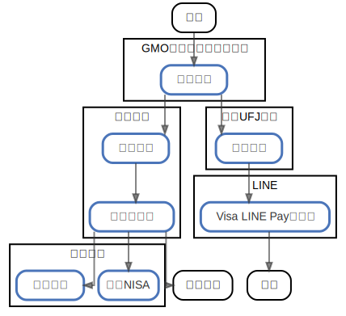

# 金のアーキテクチャ

  [ <a href="../ndiag.descriptions/_index.md">:pencil2: Edit description</a> ]

## Nodes

| Name | Description |
| --- | --- |
| [GMOあおぞらネット銀行](node-gmoあおぞらネット銀行.md) | <a href="../ndiag.descriptions/_node-gmoあおぞらネット銀行.md">:pencil2:</a> |
| [三菱UFJ銀行](node-三菱ufj銀行.md) | <a href="../ndiag.descriptions/_node-三菱ufj銀行.md">:pencil2:</a> |
| [楽天銀行](node-楽天銀行.md) | <a href="../ndiag.descriptions/_node-楽天銀行.md">:pencil2:</a> |
| [住信SBIネット銀行](node-住信sbiネット銀行.md) | <a href="../ndiag.descriptions/_node-住信sbiネット銀行.md">:pencil2:</a> |
| [楽天証券](node-楽天証券.md) | <a href="../ndiag.descriptions/_node-楽天証券.md">:pencil2:</a> |
| [三井住友カード](node-三井住友カード.md) | <a href="../ndiag.descriptions/_node-三井住友カード.md">:pencil2:</a> |
| [セゾンカード](node-セゾンカード.md) | <a href="../ndiag.descriptions/_node-セゾンカード.md">:pencil2:</a> |
| [セブンカード](node-セブンカード.md) | <a href="../ndiag.descriptions/_node-セブンカード.md">:pencil2:</a> |
| [プルデンシャル生命](node-プルデンシャル生命.md) | <a href="../ndiag.descriptions/_node-プルデンシャル生命.md">:pencil2:</a> |
| [県民共済](node-県民共済.md) | <a href="../ndiag.descriptions/_node-県民共済.md">:pencil2:</a> |
| [イオン銀行](node-イオン銀行.md) | <a href="../ndiag.descriptions/_node-イオン銀行.md">:pencil2:</a> |
| [千葉銀行](node-千葉銀行.md) | <a href="../ndiag.descriptions/_node-千葉銀行.md">:pencil2:</a> |

## Layers

| Name | Description |
| --- | --- |

## Labels

| Name | Description |
| --- | --- |

---

> Generated by [ndiag](https://github.com/k1LoW/ndiag)
