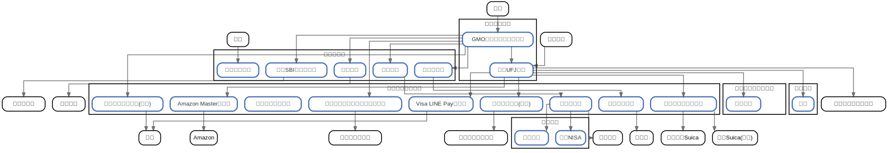

# 金のアーキテクチャ

  [ <a href="../ndiag.descriptions/_index.md">:pencil2: Edit description</a> ]

## Nodes

| Name | Description |
| --- | --- |
| [メインバンク](node-メインバンク.md) | <a href="../ndiag.descriptions/_node-メインバンク.md">:pencil2:</a> |
| [サブバンク](node-サブバンク.md) | <a href="../ndiag.descriptions/_node-サブバンク.md">:pencil2:</a> |
| [楽天証券](node-楽天証券.md) | <a href="../ndiag.descriptions/_node-楽天証券.md">:pencil2:</a> |
| [クレジットカード](node-クレジットカード.md) | <a href="../ndiag.descriptions/_node-クレジットカード.md">:pencil2:</a> |
| [プルデンシャル生命](node-プルデンシャル生命.md) | <a href="../ndiag.descriptions/_node-プルデンシャル生命.md">:pencil2:</a> |
| [県民共済](node-県民共済.md) | <a href="../ndiag.descriptions/_node-県民共済.md">:pencil2:</a> |

## Layers

| Name | Description |
| --- | --- |

## Labels

| Name | Description |
| --- | --- |

---

> Generated by [ndiag](https://github.com/k1LoW/ndiag)
