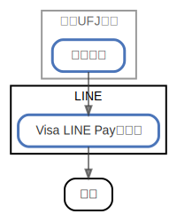

# LINE

  [ <a href="../ndiag.descriptions/_node-line.md">:pencil2: Edit description</a> ]

## Components

| Name | Description | From (Relation) | To (Relation) |
| --- | --- | --- | --- |
| line:visa line payカード |  <a href="../ndiag.descriptions/_component-line_visa_line_payカード.md">:pencil2:</a> | [三菱ufj銀行:普通口座](node-三菱ufj銀行.md) | 世界 |

## Labels

| Name | Description |
| --- | --- |

---

> Generated by [ndiag](https://github.com/k1LoW/ndiag)
