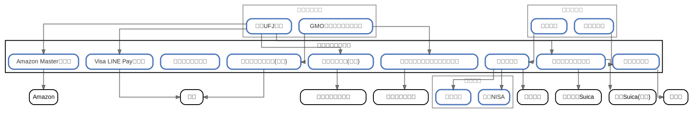

# クレジットカード

  [ <a href="../ndiag.descriptions/_node-クレジットカード.md">:pencil2: Edit description</a> ]

## Components

| Name | Description | From (Relation) | To (Relation) |
| --- | --- | --- | --- |
| クレジットカード:amazon masterカード |  <a href="../ndiag.descriptions/_component-クレジットカード_amazon_masterカード.md">:pencil2:</a> | [メインバンク:三菱ufj銀行](node-メインバンク.md) | amazon |
| クレジットカード:visa line payカード |  <a href="../ndiag.descriptions/_component-クレジットカード_visa_line_payカード.md">:pencil2:</a> | [メインバンク:三菱ufj銀行](node-メインバンク.md) | 世界 |
| クレジットカード:セゾンアメックス(家族) |  <a href="../ndiag.descriptions/_component-クレジットカード_セゾンアメックス(家族).md">:pencil2:</a> | [メインバンク:gmoあおぞらネット銀行](node-メインバンク.md) | 世界 |
| クレジットカード:三井ショッピングパークカード |  <a href="../ndiag.descriptions/_component-クレジットカード_三井ショッピングパークカード.md">:pencil2:</a> | [メインバンク:gmoあおぞらネット銀行](node-メインバンク.md) | ららぽーとなど |
| クレジットカード:セブンカード(家族) |  <a href="../ndiag.descriptions/_component-クレジットカード_セブンカード(家族).md">:pencil2:</a> | [メインバンク:三菱ufj銀行](node-メインバンク.md) | イトーヨーカドー |
| クレジットカード:楽天カード |  <a href="../ndiag.descriptions/_component-クレジットカード_楽天カード.md">:pencil2:</a> | [サブバンク:楽天銀行](node-サブバンク.md) | [楽天証券:積立nisa](node-楽天証券.md) / [楽天証券:投資信託](node-楽天証券.md) / 楽天市場 |
| クレジットカード:イオンカード |  <a href="../ndiag.descriptions/_component-クレジットカード_イオンカード.md">:pencil2:</a> | [サブバンク:イオン銀行](node-サブバンク.md) | イオン |

## Labels

| Name | Description |
| --- | --- |

---

> Generated by [ndiag](https://github.com/k1LoW/ndiag)
