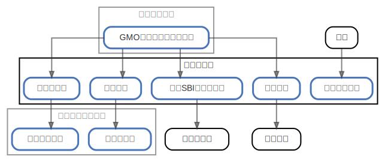

# サブバンク

  [ <a href="../ndiag.descriptions/_node-サブバンク.md">:pencil2: Edit description</a> ]

## Components

| Name | Description | From (Relation) | To (Relation) |
| --- | --- | --- | --- |
| サブバンク:楽天銀行 |  <a href="../ndiag.descriptions/_component-サブバンク_楽天銀行.md">:pencil2:</a> | [メインバンク:gmoあおぞらネット銀行](node-メインバンク.md) | [クレジットカード:楽天カード](node-クレジットカード.md) |
| サブバンク:住信sbiネット銀行 |  <a href="../ndiag.descriptions/_component-サブバンク_住信sbiネット銀行.md">:pencil2:</a> | [メインバンク:gmoあおぞらネット銀行](node-メインバンク.md) | 住宅ローン |
| サブバンク:イオン銀行 |  <a href="../ndiag.descriptions/_component-サブバンク_イオン銀行.md">:pencil2:</a> | [メインバンク:gmoあおぞらネット銀行](node-メインバンク.md) | [クレジットカード:イオンカード](node-クレジットカード.md) |
| サブバンク:千葉銀行 |  <a href="../ndiag.descriptions/_component-サブバンク_千葉銀行.md">:pencil2:</a> | [メインバンク:gmoあおぞらネット銀行](node-メインバンク.md) | 学費など |
| サブバンク:ゆうちょ銀行 |  <a href="../ndiag.descriptions/_component-サブバンク_ゆうちょ銀行.md">:pencil2:</a> | 日本 |  |

## Labels

| Name | Description |
| --- | --- |

---

> Generated by [ndiag](https://github.com/k1LoW/ndiag)
