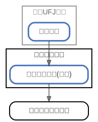

# セブンカード

  [ <a href="../ndiag.descriptions/_node-セブンカード.md">:pencil2: Edit description</a> ]

## Components

| Name | Description | From (Relation) | To (Relation) |
| --- | --- | --- | --- |
| セブンカード:セブンカード(家族) |  <a href="../ndiag.descriptions/_component-セブンカード_セブンカード(家族).md">:pencil2:</a> | [三菱ufj銀行:普通口座](node-三菱ufj銀行.md) | イトーヨーカドー |

## Labels

| Name | Description |
| --- | --- |

---

> Generated by [ndiag](https://github.com/k1LoW/ndiag)
