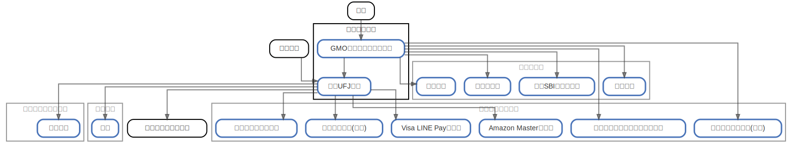

# メインバンク

  [ <a href="../ndiag.descriptions/_node-メインバンク.md">:pencil2: Edit description</a> ]

## Components

| Name | Description | From (Relation) | To (Relation) |
| --- | --- | --- | --- |
| メインバンク:gmoあおぞらネット銀行 |  <a href="../ndiag.descriptions/_component-メインバンク_gmoあおぞらネット銀行.md">:pencil2:</a> | 会社 | [メインバンク:三菱ufj銀行](node-メインバンク.md) / [サブバンク:楽天銀行](node-サブバンク.md) / [サブバンク:住信sbiネット銀行](node-サブバンク.md) / [クレジットカード:セゾンアメックス(家族)](node-クレジットカード.md) / [クレジットカード:三井ショッピングパークカード](node-クレジットカード.md) / [サブバンク:イオン銀行](node-サブバンク.md) / [サブバンク:千葉銀行](node-サブバンク.md) |
| メインバンク:三菱ufj銀行 |  <a href="../ndiag.descriptions/_component-メインバンク_三菱ufj銀行.md">:pencil2:</a> | [メインバンク:gmoあおぞらネット銀行](node-メインバンク.md) / 習志野市 | [クレジットカード:visa line payカード](node-クレジットカード.md) / 管理費・修繕積立金 / [クレジットカード:amazon masterカード](node-クレジットカード.md) / [クレジットカード:セブンカード(家族)](node-クレジットカード.md) / [プルデンシャル生命:生命保険](node-プルデンシャル生命.md) / [県民共済:保険](node-県民共済.md) |

## Labels

| Name | Description |
| --- | --- |

---

> Generated by [ndiag](https://github.com/k1LoW/ndiag)
