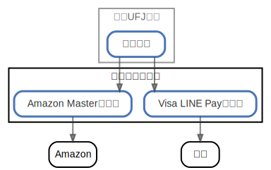

# 三井住友カード

  [ <a href="../ndiag.descriptions/_node-三井住友カード.md">:pencil2: Edit description</a> ]

## Components

| Name | Description | From (Relation) | To (Relation) |
| --- | --- | --- | --- |
| 三井住友カード:amazon masterカード |  <a href="../ndiag.descriptions/_component-三井住友カード_amazon_masterカード.md">:pencil2:</a> | [三菱ufj銀行:普通口座](node-三菱ufj銀行.md) | amazon |
| 三井住友カード:visa line payカード |  <a href="../ndiag.descriptions/_component-三井住友カード_visa_line_payカード.md">:pencil2:</a> | [三菱ufj銀行:普通口座](node-三菱ufj銀行.md) | 世界 |

## Labels

| Name | Description |
| --- | --- |

---

> Generated by [ndiag](https://github.com/k1LoW/ndiag)
