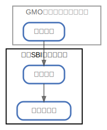

# 住信SBIネット銀行

  [ <a href="../ndiag.descriptions/_node-住信sbiネット銀行.md">:pencil2: Edit description</a> ]

## Components

| Name | Description | From (Relation) | To (Relation) |
| --- | --- | --- | --- |
| 住信sbiネット銀行:普通口座 |  <a href="../ndiag.descriptions/_component-住信sbiネット銀行_普通口座.md">:pencil2:</a> | [gmoあおぞらネット銀行:普通口座](node-gmoあおぞらネット銀行.md) | [住信sbiネット銀行:住宅ローン](node-住信sbiネット銀行.md) |
| 住信sbiネット銀行:住宅ローン |  <a href="../ndiag.descriptions/_component-住信sbiネット銀行_住宅ローン.md">:pencil2:</a> | [住信sbiネット銀行:普通口座](node-住信sbiネット銀行.md) |  |

## Labels

| Name | Description |
| --- | --- |

---

> Generated by [ndiag](https://github.com/k1LoW/ndiag)
