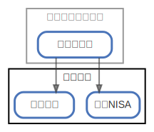

# 楽天証券

  [ <a href="../ndiag.descriptions/_node-楽天証券.md">:pencil2: Edit description</a> ]

## Components

| Name | Description | From (Relation) | To (Relation) |
| --- | --- | --- | --- |
| 楽天証券:積立nisa |  <a href="../ndiag.descriptions/_component-楽天証券_積立nisa.md">:pencil2:</a> | [楽天銀行:楽天カード](node-楽天銀行.md) |  |
| 楽天証券:投資信託 |  <a href="../ndiag.descriptions/_component-楽天証券_投資信託.md">:pencil2:</a> | [楽天銀行:楽天カード](node-楽天銀行.md) |  |

## Labels

| Name | Description |
| --- | --- |

---

> Generated by [ndiag](https://github.com/k1LoW/ndiag)
