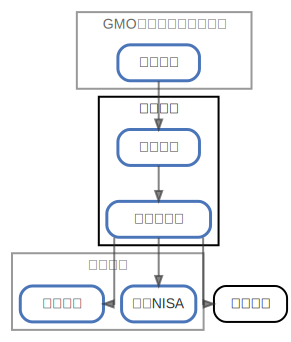

# 楽天銀行

  [ <a href="../ndiag.descriptions/_node-楽天銀行.md">:pencil2: Edit description</a> ]

## Components

| Name | Description | From (Relation) | To (Relation) |
| --- | --- | --- | --- |
| 楽天銀行:普通口座 |  <a href="../ndiag.descriptions/_component-楽天銀行_普通口座.md">:pencil2:</a> | [gmoあおぞらネット銀行:普通口座](node-gmoあおぞらネット銀行.md) | [楽天銀行:楽天カード](node-楽天銀行.md) |
| 楽天銀行:楽天カード |  <a href="../ndiag.descriptions/_component-楽天銀行_楽天カード.md">:pencil2:</a> | [楽天銀行:普通口座](node-楽天銀行.md) | [楽天証券:積立nisa](node-楽天証券.md) / [楽天証券:投資信託](node-楽天証券.md) / 楽天市場 |

## Labels

| Name | Description |
| --- | --- |

---

> Generated by [ndiag](https://github.com/k1LoW/ndiag)
