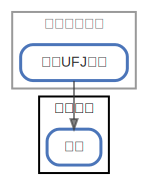

# 県民共済

  [ <a href="../ndiag.descriptions/_node-県民共済.md">:pencil2: Edit description</a> ]

## Components

| Name | Description | From (Relation) | To (Relation) |
| --- | --- | --- | --- |
| 県民共済:保険 |  <a href="../ndiag.descriptions/_component-県民共済_保険.md">:pencil2:</a> | [メインバンク:三菱ufj銀行](node-メインバンク.md) |  |

## Labels

| Name | Description |
| --- | --- |

---

> Generated by [ndiag](https://github.com/k1LoW/ndiag)
